 

## About Me

- **琉球大学大学院 理工学研究科 工学専攻** 在籍
- 研究テーマ：**コールセンター応対品質の自動評価**（NLP / LLM の実応用）
- 興味分野：自然言語処理・生成AI・Webアプリケーション開発

## Research

**コールセンター応対品質の自動評価**

オペレーターの応対テキストを対象に、自然言語処理・大規模言語モデルを活用して応対品質を自動で評価する手法を研究しています。人手評価のコスト削減と評価基準の一貫性向上を目指しています。

## Products

### [TabiSync](https://tabisync.com) — 旅行のしおり作成・共有サービス

> 旅の計画をひとつに。しおりを作って、仲間とシェア。

- 旅行のしおり（旅程表）をブラウザ上で簡単に作成・編集
- URL共有で同行者とリアルタイムに旅程を共有
- 個人開発として **開発から運用まで一貫して担当**

<!-- スクリーンショットがあればここに追加

  

-->

## Tech Stack

**LANGUAGES**

 

**FRAMEWORKS & LIBRARIES**

 

**TOOLS & INFRASTRUCTURE**

